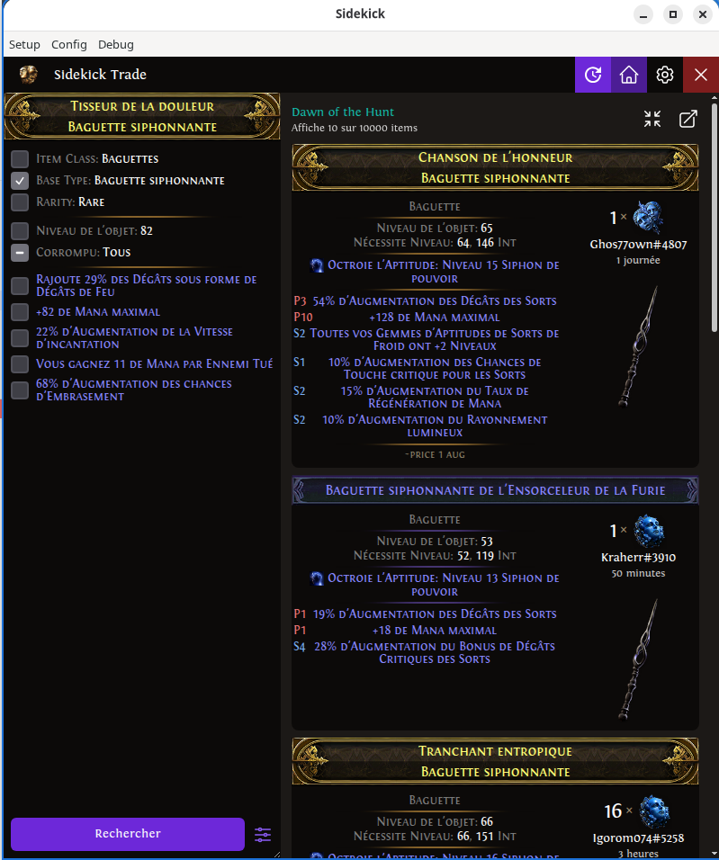
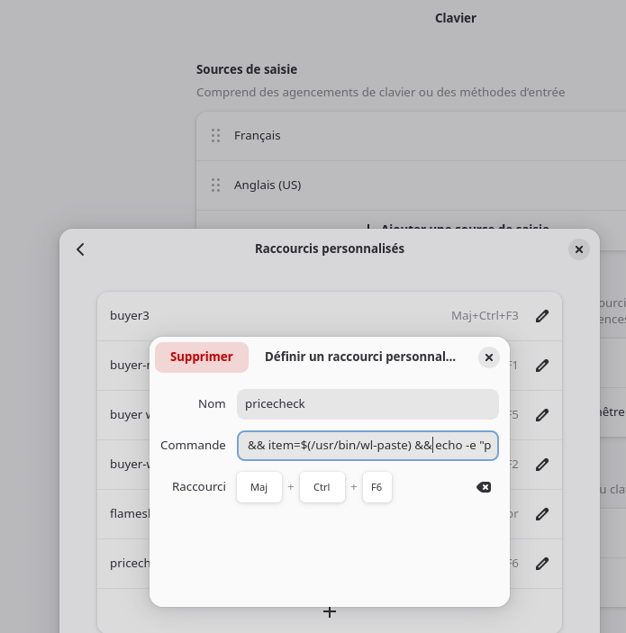

[](https://github.com/mmaura/poe2linuxcompanion/actions/workflows/build.yml)

# Poe2 Linux Companion

Est un companion de jeux pour PAth of Exile 2 destiné à fonctionner sous Linux / Wayland.

J'ai pris la décision de faire ce programme par passion à la fois pour POE et pour la programmation. Le logiciel est fait pour fonctionner en francais, mais il est facile de la faire fonctionner dans toutes les langues.
TODO: J'y ajouterais probablement l'anglais.

## Prérequis

[ydotool](https://github.com/ReimuNotMoe/ydotool)
xdotool
socat
wl-clipboard (wl-paste)
[Sidekick](https://sidekick-poe.github.io/) (version docker)

### Arch linux (cachyos)

```sh
pacman -S ydotool xdotool socat wl-clipboard

```

## Caractéristiques

### Vérificateur de prix

Le vérificateur de prix s'appuit sur [Sidekick](https://sidekick-poe.github.io/).

Le vérificateur s'occupe de copier l'item, d'afficher le resultat de recherche [Sidekick](https://sidekick-poe.github.io/) dans une fenetre dédiée.

Toute les langues de [Sidekick](https://sidekick-poe.github.io/) sont supportée, elles peuvent être configurées en cliquant sur **config**.



```sh
# verifier un prix
sh -c '/usr/bin/ydotool key -d 60 29:1 46:1 46:0 29:0 && sleep 0.1 && item=$(/usr/bin/wl-paste) && echo -e "pricecheck\n$item" | /usr/bin/socat - UNIX-CONNECT:/run/user/$(id -u)/poe2linuxcompanion.socket'
```

### Tradder

Le module tradder, permet d'echanger avec les autres joureurs. C'est un classique (invite/trade/kick/..).
Si vous voulez supporter votre langue, il suffit de l'ajouter au dictionnaire dans [logprocessor.ts](electron/main/components/logprocessor.ts)

```sh
#commande pour choisir la commande suivante de l'échange 1
sh -c 'echo -e "buyer-next-command\n1" | /usr/bin/socat - UNIX-CONNECT:/run/user/$(id -u)/poe2linuxcompanion.socket'

#commande pour choisir la commande suivante de l'échange 2
sh -c 'echo -e "buyer-next-command\n2" | /usr/bin/socat - UNIX-CONNECT:/run/user/$(id -u)/poe2linuxcompanion.socket'

# dire d'attendre au dernier wisper
sh -c 'echo "buyer-wait" | /usr/bin/socat - UNIX-CONNECT:/run/user/$(id -u)/poe2linuxcompanion.socket'
```

# Mise en place des raccourcis

Toute la problématique d'overlay est contournée par l'utilisation de raccourcis claviers configurés au niveau du gestionnaire de fenetre (Gnome, KDE, ...).


